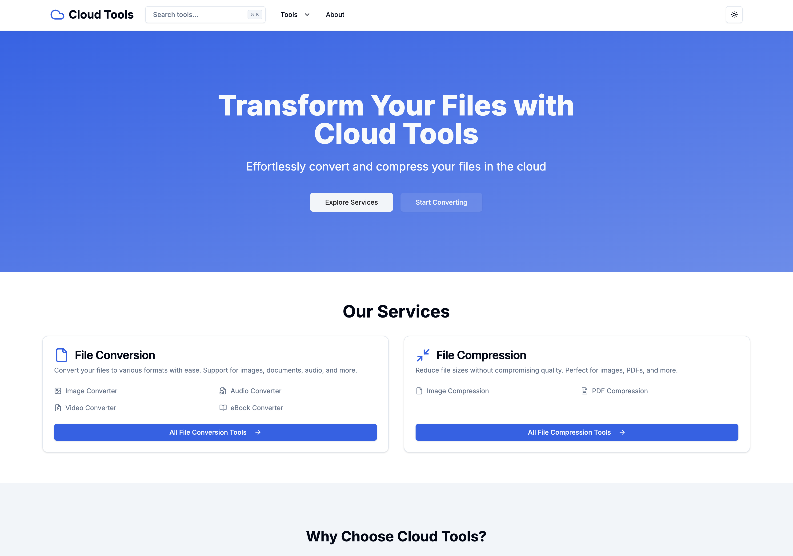

# Cloud Tools




_Cloud Tools_ is a AWS cloud-based service that provides users with a platform to convert or compress files.

## Why Did I Build _Cloud Tools_?

In preparation for the [AWS Solutions Architect Associate](https://aws.amazon.com/certification/certified-solutions-architect-associate/?ch=sec&sec=rmg&d=1) exam, I sought to apply my Amazon AWS knowledge to a real-world project. This endeavor not only reinforces my understanding of AWS services but also provides a tangible showcase of my skills in designing and implementing cloud-based solutions. By building _Cloud_, I can demonstrate my ability to architect a scalable, efficient, and secure system, highlighting the practical application of the concepts I've learned.

## System Architecture

```mermaid
graph TD;
    subgraph Frontend
        A[User Browser] --> B[Vercel]
        B --> C[Static Website]
    end

    subgraph Backend
        C --> D[API Gateway]
        D --> E[Lambda Function - Convert Files]
        D --> F[Lambda Function - Compress Files]
    end

    subgraph Storage & Processing
        E --> G[S3 Bucket for File Storage]
        F --> G
        G --> H[Lambda Function - Process Files]
    end

    subgraph Database & Queue
        H --> I[DynamoDB for Conversion History]
        H --> J[SQS for Processing Queue]
        J --> H
    end

    subgraph Monitoring
        E --> K[CloudWatch for Logs & Metrics]
        F --> K
        H --> K
    end

    subgraph Security
        B --> L[WAF for Web Application Firewall]
        D --> M[API Gateway Authorizer]
    end
```

### Explanation:

1. **Frontend**:
   - **User Browser**: The client-side interface where users interact with the application.
   - **Vercel**: Hosts and deploys the static website, providing fast and reliable content delivery.
   - **Static Website**: The frontend application, including HTML, CSS, and JavaScript files, is hosted on Vercel.

2. **Backend**:
   - **API Gateway**: Acts as the entry point for API requests from the frontend. It routes requests to appropriate Lambda functions.
   - **Lambda Functions**:
     - **Convert Files**: Handles file conversion tasks.
     - **Compress Files**: Handles file compression tasks.

3. **Storage & Processing**:
   - **S3 Bucket for File Storage**: Stores uploaded files temporarily during processing.
   - **Lambda Function - Process Files**: Further processes files, like storing results or updating status.

4. **Database & Queue**:
   - **DynamoDB for Conversion History**: Stores metadata about file conversions and compressions for history tracking.
   - **SQS for Processing Queue**: Manages file processing tasks asynchronously to handle high loads efficiently.

5. **Monitoring**:
   - **CloudWatch for Logs & Metrics**: Monitors application performance, logs, and metrics for Lambda functions and other AWS services.

6. **Security**:
   - **WAF for Web Application Firewall**: Protects the application from common web exploits.
   - **API Gateway Authorizer**: Handles authentication and authorization for API requests, ensuring secure access to backend services.

This architecture leverages Vercel for hosting the frontend, providing seamless integration for deploying static sites, while utilizing AWS's serverless infrastructure for backend processing, ensuring scalability and security.

## Getting Started

This is a [Next.js](https://nextjs.org) project bootstrapped with [`create-next-app`](https://nextjs.org/docs/app/api-reference/cli/create-next-app).

First, run the development server:

```bash
npm run dev
# or
yarn dev
# or
pnpm dev
# or
bun dev
```

Open [http://localhost:3000](http://localhost:3000) with your browser to see the result.

You can start editing the page by modifying `app/page.tsx`. The page auto-updates as you edit the file.

This project uses [`next/font`](https://nextjs.org/docs/app/building-your-application/optimizing/fonts) to automatically optimize and load [Geist](https://vercel.com/font), a new font family for Vercel.

## Learn More

To learn more about Next.js, take a look at the following resources:

- [Next.js Documentation](https://nextjs.org/docs) - learn about Next.js features and API.
- [Learn Next.js](https://nextjs.org/learn) - an interactive Next.js tutorial.

You can check out [the Next.js GitHub repository](https://github.com/vercel/next.js) - your feedback and contributions are welcome!

## Deploy on Vercel

The easiest way to deploy your Next.js app is to use the [Vercel Platform](https://vercel.com/new?utm_medium=default-template&filter=next.js&utm_source=create-next-app&utm_campaign=create-next-app-readme) from the creators of Next.js.

Check out our [Next.js deployment documentation](https://nextjs.org/docs/app/building-your-application/deploying) for more details.
